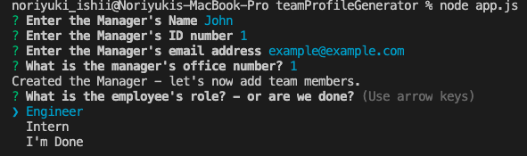
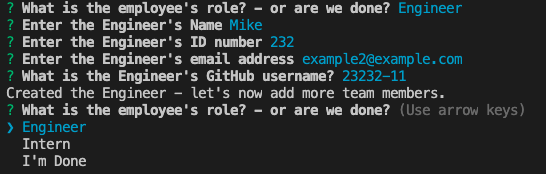
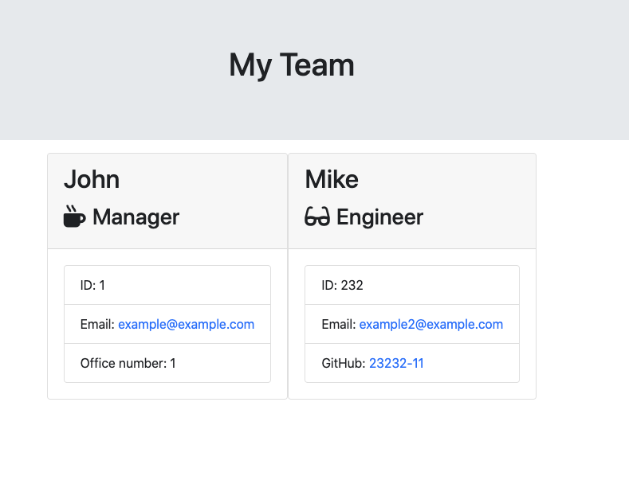
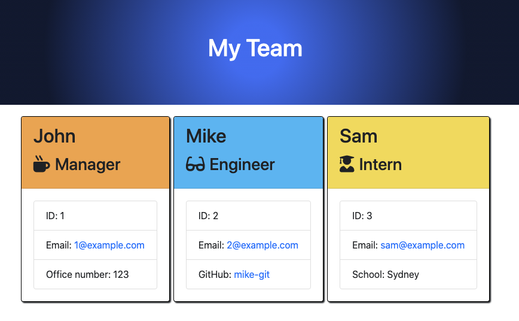

# teamProfileGenerator

## Table of Contents

- [Description](#description)
- [How to Install Dependencies](#how-to-install-dependencies)
- [Usage](#usage)
- [License](#license)
- [Contributoring](#contributing)
- [Tests](#tests)
- [Questions](#questions)

## Description

This is a command-line application that dynamically generates an HTML file with the information of your engineering team members. The user is to input any number of team members (with ONE manager and any mix of engineers and interns) with appropriate data entries. When the user has completed building the team, the application will create an HTML file that displays a nicely formatted team roster based on the information provided by the user.

## How to install dependencies

Please use: npm i

## Usage

Screenshot 1: The application firstly offers the user to input the information of the Manager. Input validation in place for names (number-proof), ID (integer-proof) and email address.

---

Screenshot 2: A t the end of the manager inputs, the user is given the choice to enter the information of either an engineer or an intern, OR to end the input.

---

Screenshot 3: The CLI offers the inputs for the engineer's information (which is slightly different from the one of the Manager). At the end of the input, the user is again offered the choice to keep entering team members or finish the process.

---

Screenshot 4: Once the user hits "I'm Done" the application will generate an HTML file with the data entered. (the design of the website is subject to change)

---

Screenshot 5: Design updated.

An example of the generated file can be found in the output folder.

## License

MIT

## Contributing

Pull requests are welcome. For major changes, please open an issue first to discuss what you would like to change. Also, please make sure to update tests as appropriate.

## Questions

[Email Me!](mailto:nishii.dev.syd@gmail.com)

[Link to my GitHub](https://github.com/noriyuki-ishii-820)
